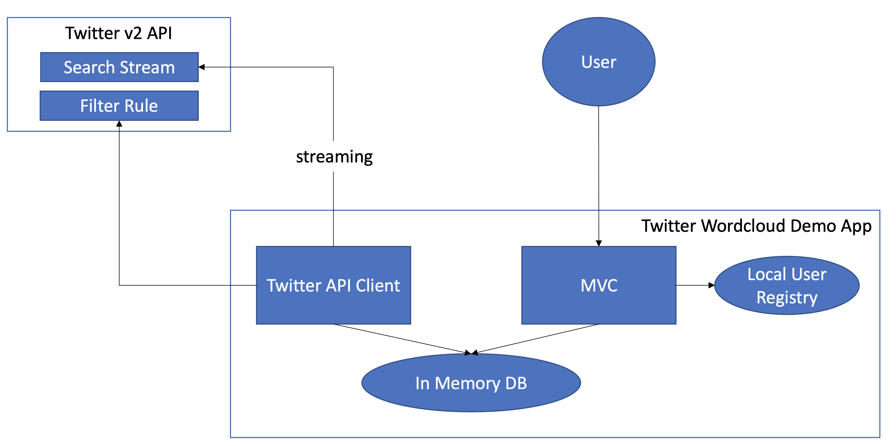
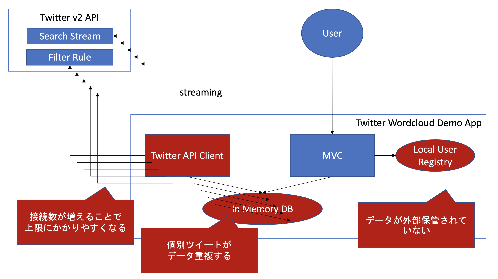

# リアルタイム Twitter ワードクラウド生成

Twitter v2 API のストリーム機能で、ほぼリアルタイムでTwitterからワードクラウドを生成できるアプリケーションです。


以下二つの起動方法があります。
- スタンドアロンモード
- スケールアウトモード

以下の技術を利用しています。

- Spring Boot
- [Twitter API Client Library for Java](https://github.com/twitterdev/twitter-api-java-sdk)
- [Kuromoji](https://github.com/atilika/kuromoji)
- [D3 Cloud](https://github.com/jasondavies/d3-cloud)

スケールアウトモードは以下の技術も利用します。
- [Spring Security OAuth2.0](https://spring.io/guides/tutorials/spring-boot-oauth2/)
- [Spring Cloud Sleuth](https://spring.io/projects/spring-cloud-sleuth)
- [RabbitMQ](https://www.rabbitmq.com/)
- [PostgreSQL](https://www.postgresql.org/)
- [Wavefront](https://tanzu.vmware.com/observability)

## スタンドアロンモード

### アーキテクチャ図



スタンドアロンモードの場合、全てのコンポーネントが一つのアプリケーション上で起動します。

- 起動時に設定したハッシュタグをもとに、Twitter APIの[Stream Rule](https://developer.twitter.com/en/docs/twitter-api/tweets/filtered-stream/api-reference/post-tweets-search-stream-rules)を設定します。
- TwitterのStream機能を利用して、該当ツィートを受信します。
- 該当のツィートをデータベースに保管します。
- データベースの内容をMVCアプリケーションで表示します。
- 一部のUIでアクセス制限をかけており、ローカルのユーザーレジストリをもとにユーザー認証を行います。

> :warning: スタンドアロンモードでは、スケールアウトはサポートされません。
### 準備

- Java 11 以上がインストールされた端末
- [Twitter v2 API Bearer Token](https://developer.twitter.com/en/docs/authentication/oauth-2-0/bearer-tokens)

### 起動方法

```
export TWITTER_BEARER_TOKEN="AAAA...BSufQEAAAAAp9W..."
export TWITTER_HASHTAGS="#HASTHAG_TO_SEARCH"
git clone https://github.com/mhoshi-vm/twitter-wordcloud-demo
cd twitter-wordcloud-demo
./mvnw spring-boot:run
```

### 注意点

スタンドアロンモードの場合、スケールアウトが以下の理由によりサポートされません。

- Twitter APIへのアクセス数、コネクション数がふえてしまうことにより、[APIの上限値に抵触しやすくなります](https://developer.twitter.com/ja/docs/twitter-api/rate-limits)。
- 個々のTweetが全インスタンスに配布されるため、データベースのレコードが重複します。
- データベースやユーザーレジストリを外部に保管しないため、それぞれのインスタンスがデータを共有しません。


## スケールアウトモード


スケールアウトモードは "stateful", "stateless" 二つの起動方法が用意され、以下のように機能します。

- Stateful
  - Twitter APIへ通信するコンポーネントのみが起動します。
  - スケールアウトはサポートされず、インスタンスは１つ以上は起動しないでください。
  - Twitter のストリームから転送されたツィートをスタンドアロンモードとは異なり、RabbitMQに保管します。
- Stateless
  - スケールアウトがサポートされます。
  - RabbitMQ経由で非同期にツィートを受け取りデータベースに書き込みます
  - 認証は外部のOAuth2.0に対応したユーザーレジストリと繋ぎます。

### 前提

スタンドアロンモードに加え、以下を用意してください。

- RabbitMQ
- PostgreSQL
- OAuth2.0 Endpoint

### 起動方法

`application-stateful.properties` ファイルを用意してください。

```
## Mandatory
twitter.bearer.token=TWITTER_BEARER_TOKEN
twitter.hash.tags="#HASTHAG_TO_SEARCH"
spring.rabbitmq.host=RABBITMQ_HOST
spring.rabbitmq.password=RABBITMQ_PASSWORD
spring.rabbitmq.port=RABBITMQ_PORT
spring.rabbitmq.username=RABBITMQ_USERNAME

## Optional
management.metrics.export.wavefront.api-token=WAVEFRONT_TOKEN
management.metrics.export.wavefront.uri=WAVEFRONT_URI
management.metrics.export.wavefront.enabled=true
wavefront.tracing.enabled=true
wavefront.freemium-account=false
```

`application-stateless.properties` ファイルを用意してください。

```
## Mandatory
spring.rabbitmq.host=RABBITMQ_HOST
spring.rabbitmq.password=RABBITMQ_PASSWORD
spring.rabbitmq.port=RABBITMQ_PORT
spring.rabbitmq.username=RABBITMQ_USERNAME
spring.datasource.driver-class-name=org.postgresql.Driver
spring.datasource.password=POSTGRES_PASSWORD
spring.datasource.url=POSTGRES_URL
spring.datasource.username=POSTGRES_USERNAME
spring.r2dbc.url=POSTGRES_URI
spring.r2dbc.password=POSTGRES_PASSWORD
spring.r2dbc.username=POSTGRES_USERNAME
spring.security.oauth2.client.registration.{name}.client-id=client-id
spring.security.oauth2.client.registration.{name}.client-secret	=client-secret
spring.security.oauth2.client.registration.{name}.provider=provider
spring.security.oauth2.client.registration.{name}.client-name=client-name
spring.security.oauth2.client.registration.{name}.client-authentication-method=client-authmode
spring.security.oauth2.client.registration.{name}.authorization-grant-type=grant-type
spring.security.oauth2.client.registration.{name}.redirect-uri=redirect-uri
spring.security.oauth2.client.registration.{name}.scope=scope
spring.security.oauth2.client.provider.{provider}.issuer-uri=issuer-uri
spring.security.oauth2.client.provider.{provider}.authorization-uri=autorization-uri
spring.security.oauth2.client.provider.{provider}.token-uri=token-uri
spring.security.oauth2.client.provider.{provider}.user-info-uri=user-info-uri
spring.security.oauth2.client.provider.{provider}.user-info-authentication-method=user-info-authentication-method
spring.security.oauth2.client.provider.{provider}.jwk-set-uri=jwk-set-uri
spring.security.oauth2.client.provider.{provider}.user-name-attribute=user-name-attribute

## Optional
management.metrics.export.wavefront.api-token=WAVEFRONT_TOKEN
management.metrics.export.wavefront.uri=WAVEFRONT_URI
management.metrics.export.wavefront.enabled=true
wavefront.tracing.enabled=true
wavefront.freemium-account=false
```

アプリケーションを起動してください。

```
export SPRING_PROFILES_ACTIVE=stateful
./mvnw spring-boot:run
```

```
export SPRING_PROFILES_ACTIVE=stateless
./mvnw spring-boot:run
```