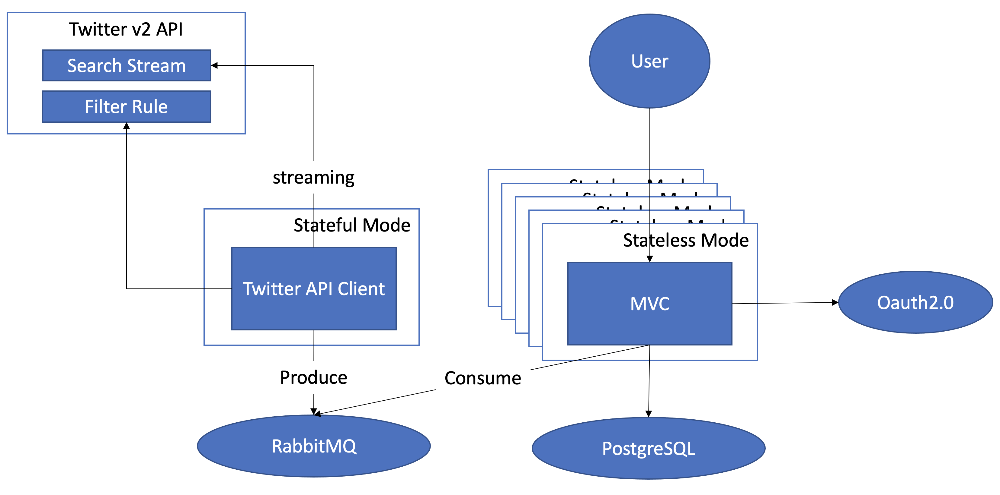

# リアルタイム Twitter ワードクラウドアプリ

このアプリは、Twitter v2 API のストリーム機能で、ほぼリアルタイムでTwitterからワードクラウドを生成できるアプリケーションです。


以下二つの起動方法があります。
- モノリスモード
- マイクロサービスモード

以下の技術が利用しています。

- Spring Boot
- [Twitter API Client Library for Java](https://github.com/twitterdev/twitter-api-java-sdk)
- [Kuromoji](https://github.com/atilika/kuromoji)
- [D3 Cloud](https://github.com/jasondavies/d3-cloud)

マイクロサービスモードは以下の技術も利用します。
- [Spring Security OAuth2.0](https://spring.io/guides/tutorials/spring-boot-oauth2/)
- [Spring Cloud Sleuth](https://spring.io/projects/spring-cloud-sleuth)
- [RabbitMQ](https://www.rabbitmq.com/)
- [PostgreSQL](https://www.postgresql.org/)
- [Wavefront](https://tanzu.vmware.com/observability)

## モノリスモード

### アーキテクチャ図
> :warning: モノリスモードでは、スケールアウトはサポートされません。


### 準備

- Java 11 以上がインストールされた端末
- [Twitter v2 API Bearer Token](https://developer.twitter.com/en/docs/authentication/oauth-2-0/bearer-tokens)

### 起動方法

```
export TWITTER_BEARER_TOKEN="AAAA...BSufQEAAAAAp9W..."
git clone https://github.com/mhoshi-vm/twitter-wordcloud-demo
cd twitter-wordcloud-demo
./mvnw spring-boot:run
```

### 注意点

モノリスモードの場合、スケールアウトが以下の理由によりサポートされません。

- Twitter APIへのアクセス数、コネクション数がふえてしまうことにより、[APIの上限値に抵触しやすくなります](https://developer.twitter.com/ja/docs/twitter-api/rate-limits)。
- 個々のTweetが全インスタンスに配布されるため、データベースのレコードが重複します。
- データベースやユーザーレジストリを外部に保管しないため、それぞれのインスタンスがデータを共有しません。


## マイクロサービスモード



マイクロサービスモードは "stateful", "stateless" 二つの起動方法が用意され、以下のように機能します。

- Stateful
  - Twitter APIへ通信するコンポーネントのみが起動します。
  - スケールアウトはサポートされず、インスタンスは１つ以上は起動しないでください。
  - Twitter のストリームから転送されたツィートをモノリスモードとは異なり、RabbitMQに保管します。
- Stateless
  - スケールアウトがサポートされます。
  - RabbitMQ経由で非同期にツィートを受け取りデータベースに書き込みます
  - 認証は外部のOAuth2.0に対応したユーザーレジストリと繋ぎます。

### 起動方法